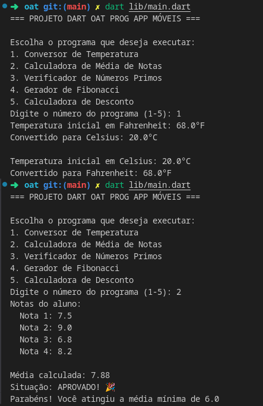

## Projeto Dart - OAT Prog App Móveis

Este repositório contém 5 programas em Dart

### Programas:
1. Conversor de Temperatura
2. Calculadora de Média de Notas
3. Verificador de Números Primos
4. Gerador de Fibonacci
5. Calculadora de Desconto

### Como usar:
1. Instale as dependências:
`dart pub get`
2. Execute o programa principal pra rodar todos:
`dart run lib/main.dart`
3. Para rodar um programa específico:
Exemplo: `dart run lib/conversor_temperatura.dart`
4. Para rodar o programa principal de forma interativa:
`dart run lib/main.dart`

---

### Exemplo de execução:

---

---

> Autor: johnpaulo